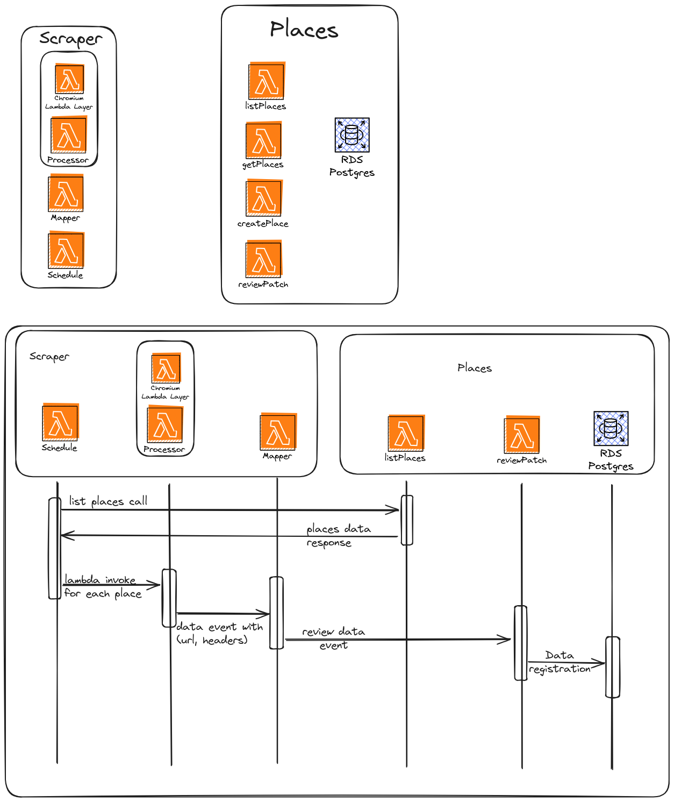

# Google maps reviews scraping

A simple project that scraps google maps reviews from registered places.

It uses webscraping with puppeteer to get to the reviews tab and intercept reviews requests. After intercept the reviews requests it sends the url and headers data to a endpoint that will fetch the reviews data and map to domain data and register on a postgres database.

## System design

This system implements microservice architechture and uses serverless framework to deploy the infrastrcture by using AWS Cloudformation.

